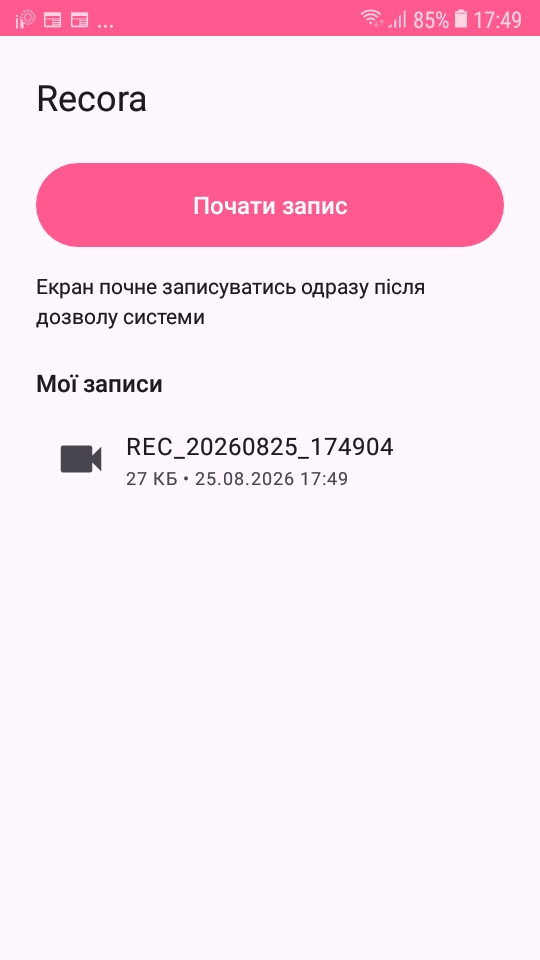
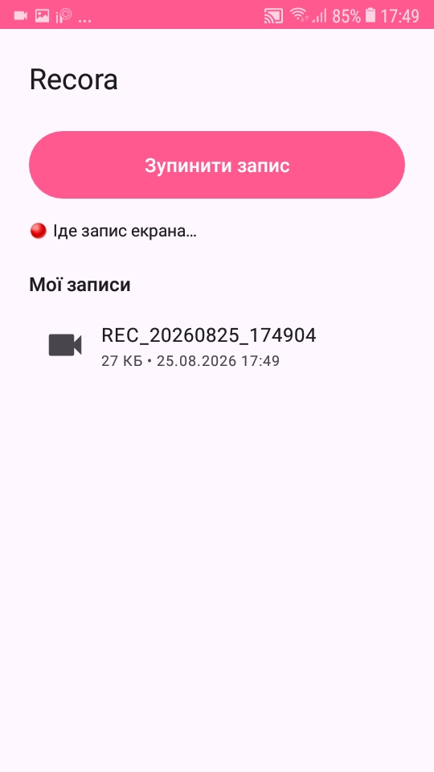

# 🌸 Recora — запис екрана для Android

---

[](https://arena.ai/agent)

 [](./LICENSE)


---

Простий застосунок для запису екрана на **Android 7.0/7.1 (API 24) і новіших**, написаний на Kotlin.
Запис виконується через MediaProjection API, відео зберігається у форматі MP4 (H.264).

> ℹ️ **Інфо:** Цей проєкт все ще `розробляється` і **може містити помилки!**
> 
> Також Додаток містить код, написаний **ШІ**, якщо вам не подобаються `«Слоп-Додатки»`, створені Штучним інтелектом: вам необов’язково завантажувати додаток! (те саме, якщо друг не любить **Додатки, створені ШІ**)
>
> Що до хороших новин.. Цей додаток є **Open Source** і я як автор цього проєкту, дозволяю використовувати та модифікувати весь код додатку!
>
> Також можна видавати його за свій додаток але можна залишити Кредити оригіналу.. (Майте повагу..)

## 📱 Скріншоти

| Головний екран | 🔴 Йде запис |
|:---:|:---:|
|  |  |

## Можливості

### ⭐ Поточні (v0.2)

- ⏺ Запис екрана у MP4 (до 1280p, 30 fps, H.264)
- 🎤 **Звук мікрофона** — перемикач на головному екрані (AAC 128 кбіт/с)
- 📂 **Збереження у «Фільми/Recora»** через MediaStore — записи видно в будь-якій галереї
  і вони залишаються після видалення застосунку
- 🗑 **Видалення записів** довгим тапом по елементу списку
- 🔔 Фоновий сервіс зі сповіщенням та кнопкою «Зупинити»
- 📼 Список записів у застосунку, перегляд по тапу

> ℹ️ На Android 7–9 для спільної теки потрібен дозвіл на сховище;
> якщо його не дати, записи потраплять у приватну теку застосунку
> (`Android/data/com.recora.app/files/Movies/ScreenRecorder`) — усе одно нічого не загубиться.

## Вимоги

- Android Studio Ladybug або новіша (або лише JDK 17+ для збірки з консолі)
- Android SDK 35 (підтягнеться автоматично в Android Studio)

## Збірка APK

### Локально (консоль)

```bash
bash gradlew assembleDebug
```

Готовий файл: `app/build/outputs/apk/debug/app-debug.apk`

### Android Studio

1. **File → Open** → оберіть теку проєкту
2. Дочекайтеся синхронізації Gradle
3. **Build → Build App Bundle(s) / APK(s) → Build APK(s)**

### GitHub Actions 🤖

Workflow уже налаштовано (`.github/workflows/android.yml`): кожен `push` у гілку
`main`/`master` автоматично збирає Debug APK.

Готовий APK забирайте тут:
**GitHub → Actions → оберіть останній запуск → Artifacts → `recora-debug-apk`**

## Публікація на GitHub

```bash
git remote add origin https://github.com/<ваш-нік>/<репозиторій>.git
git push -u origin main
```

## Структура проєкту

```
screen-recorder/
├── .github/workflows/android.yml   # CI: автозбірка APK на GitHub
├── app/
│   ├── build.gradle.kts            # конфігурація модуля (minSdk 24, target 35)
│   └── src/main/
│       ├── AndroidManifest.xml
│       ├── java/com/recora/app/
│       │   ├── MainActivity.kt         # UI, дозволи, перемикач мікрофона
│       │   ├── ScreenRecordService.kt  # запис екрана (MediaProjection + MediaRecorder)
│       │   ├── RecordingStore.kt       # MediaStore/файли: збереження, список, видалення
│       │   └── RecordingsAdapter.kt    # список відео
│       └── res/                    # макети, рядки (укр.), іконки, тема
├── build.gradle.kts                # версії AGP 8.7.3 / Kotlin 2.0.21
└── settings.gradle.kts
```

## Як це працює технічно

`MediaProjection` створює `VirtualDisplay`, який «малює» копію екрана на
`Surface` від `MediaRecorder` (H.264; з мікрофона — ще й AAC). Сервіс працює
у foreground з типом `mediaProjection` (вимога Android 14+). Збереження —
через `RecordingStore`: MediaStore у «Фільми/Recora» на Android 10+ чи прямий
файл на Android 7–9.

## Дорожня карта 🗺

| Версія | Що всередині |
|--------|-----------|
| v0.1 | ✅ Запис екрана, сервіс + сповіщення, список записів |
| v0.2 | ✅ 🎤 Звук мікрофона, 📂 «Фільми/Recora» (MediaStore), 🗑 видалення |
| v0.3 | ⚙️ Налаштування: роздільна здатність, бітрейт, FPS |
| v0.4 | ⏸ Пауза / відновлення запису (працює з Android 7.0) |
| v0.5 | 🎈 Плаваюча кнопка поверх інших застосунків |
| v0.6 | 🔊 Внутрішній звук пристрою (потребує Android 10+) |
| v0.7 | ⏱ Лічильник часу, зворотний відлік перед стартом |

## Ліцензія

[MIT](LICENSE)
